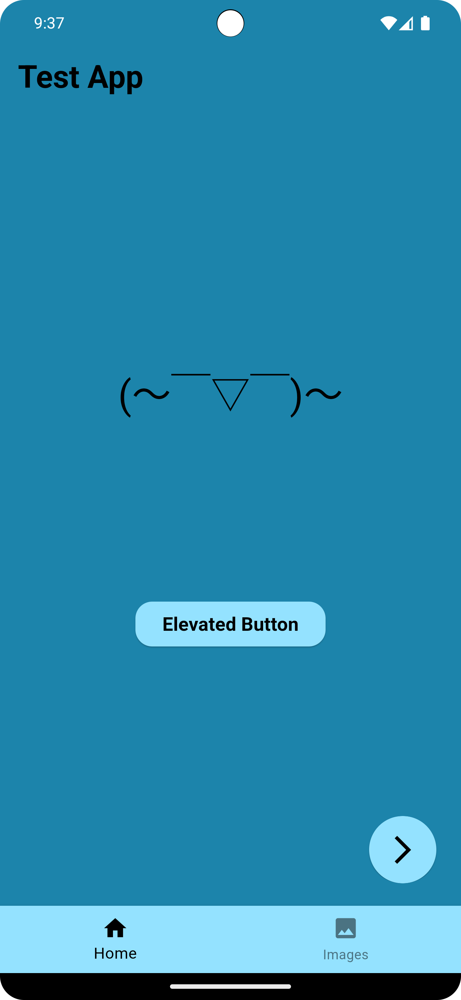
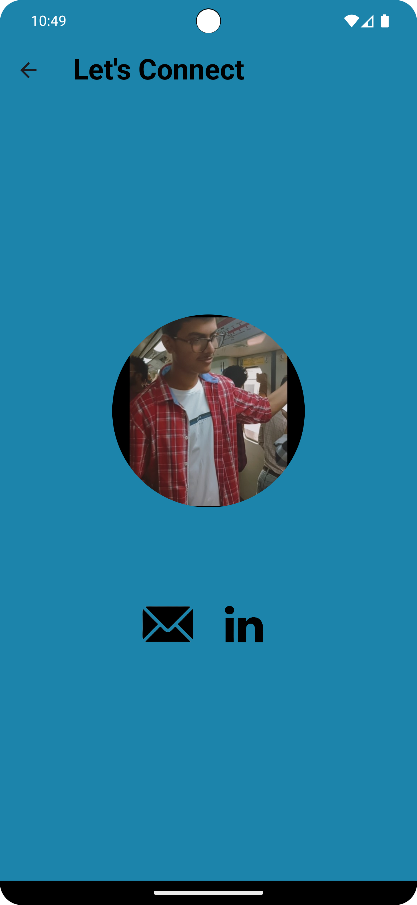

### Project Title

Basic Flutter Application

### Description

This project is a simple Flutter application demonstrating navigation between pages and dynamic UI updates using a `BottomNavigationBar`. The main page (`FirstPage`) contains a button that changes its text when pressed and another button that navigates to a `SecondPage`. The `BottomNavigationBar` allows switching between a home view and an images view, with icons that change color and size based on selection. The `SecondPage` includes functionality to copy text to the clipboard and redirect to a LinkedIn profile when an image is tapped.

### Features

- **Navigation**: Navigate between `FirstPage` and `SecondPage`.
- **Dynamic UI**: Change button text dynamically.
- **Bottom Navigation**: Switch between different views using a `BottomNavigationBar`.
- **Responsive Icons**: Icons in the `BottomNavigationBar` change color and size based on selection.
- **Clipboard Copy**: Copy text to the clipboard by tapping an image.
- **External Link**: Redirect to a LinkedIn profile by tapping an image.

### Screenshots





### Installation

1. **Clone the repository**:
    ```sh
    git clone https://github.com/sarvinshrivastava/Basic-Flutter-App.git
    cd flutter-navigation-ui-example
    ```

2. **Install dependencies**:
    ```sh
    flutter pub get
    ```

3. **Run the app**:
    ```sh
    flutter run
    ```

### Usage

- **Home View**: Press the button to shuffle and display a new text.
- **Images View**: View a list of images.
- **Navigate to Second Page**: Press the arrow head button to navigate to the `SecondPage`.
- **Copy to Clipboard**: Tap the Gmail image to copy the email to the clipboard.
- **Redirect to LinkedIn**: Tap the LinkedIn image to open the LinkedIn profile.

### Code Structure

- `lib/main.dart`: Entry point of the application.
- `lib/firstPage.dart`: Contains the `FirstPage` widget with dynamic UI and navigation logic.
- `lib/secondPage.dart`: Contains the `SecondPage` widget with clipboard copy and external link functionality.

### Dependencies

- `flutter/material.dart`: Core Flutter framework for building UI.
- `url_launcher`: Package for launching URLs.

### Contact

- **Author**: Sarvin Shrivastava
- **Email**: sarvin5124@gmail.com
- **GitHub**: [sarvinshrivastava](https://github.com/sarvinshrivastava)